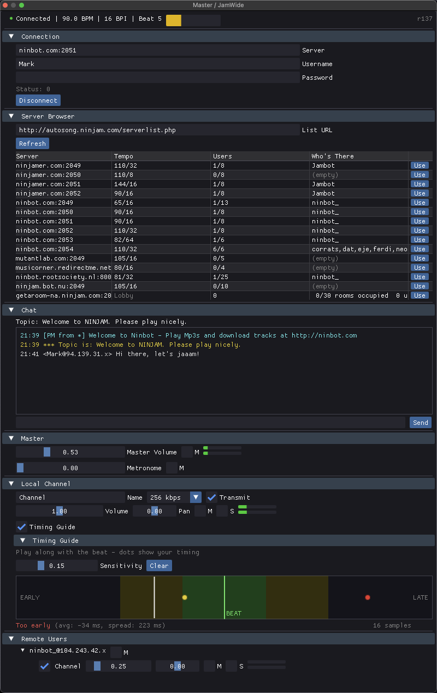

  
  <h1>JamWide</h1>
  
Jam with musicians worldwide — right inside your DAW

  
  
⚠️ <strong>Early Development</strong> — Not yet ready for production use

  
  

    <a href="/download" class="btn btn-primary">Download</a>
    <a href="https://github.com/mkschulze/JamWide" class="btn">View on GitHub</a>
  

---

## What is JamWide?

JamWide brings [NINJAM](https://www.cockos.com/ninjam/) — the open-source internet jam session software — directly into your favorite DAW as a plugin.

No more switching between apps. Load JamWide, connect to a server, and start jamming with musicians around the globe.

---

## Why Use JamWide?

| Traditional Setup | With JamWide |
|-------------------|--------------|
| Separate NINJAM app | Plugin in your DAW |
| Complex audio routing | Direct track routing |
| External recording | Record natively in DAW |
| Limited processing | Full plugin chain access |

---

## Key Features

| | |
|---|---|
| **🎛️ DAW Integration** | Load as CLAP, VST3, or Audio Unit. Works in Ableton, Logic, REAPER, Bitwig, and more. |
| **🌐 Real-Time Collaboration** | Connect to any NINJAM server. Play with musicians anywhere in the world. |
| **🎚️ Flexible Routing** | Route any track to your jam session. Apply effects to incoming audio. |
| **📼 Native Recording** | Capture everything in your DAW's timeline. No external recording needed. |
| **💬 Built-in Chat** | Communicate with other musicians in the session without leaving your DAW. |
| **🎯 Timing Guide** | Visual beat alignment feedback to help you stay in sync. |

---

## Supported Formats

| Format | Platform | Hosts |
|--------|----------|-------|
| **CLAP** | macOS, Windows | Bitwig, FL Studio, REAPER, MultitrackStudio |
| **VST3** | macOS, Windows | Ableton, Cubase, FL Studio, REAPER |
| **AU v2** | macOS | Logic Pro, GarageBand, MainStage |

---

## How NINJAM Works

Unlike traditional low-latency approaches, NINJAM embraces internet delay creatively:

1. **Everyone hears the previous interval** — You play along with what others recorded in the last cycle
2. **Time-synchronized jamming** — The server keeps everyone in sync with a shared BPM/BPI
3. **Creative collaboration** — The delayed approach creates unique musical possibilities

This means you can jam with someone across the world with the same experience as someone across town.

---

## Get Started

  <a href="/download" class="btn btn-primary btn-large">Download JamWide</a>
  
Available for macOS and Windows

---

## Open Source

JamWide is open source under the GPL-2.0 license. Contributions welcome!

  
  
  

---

*Made with ♪ for musicians who want to jam together, anywhere in the world.*
